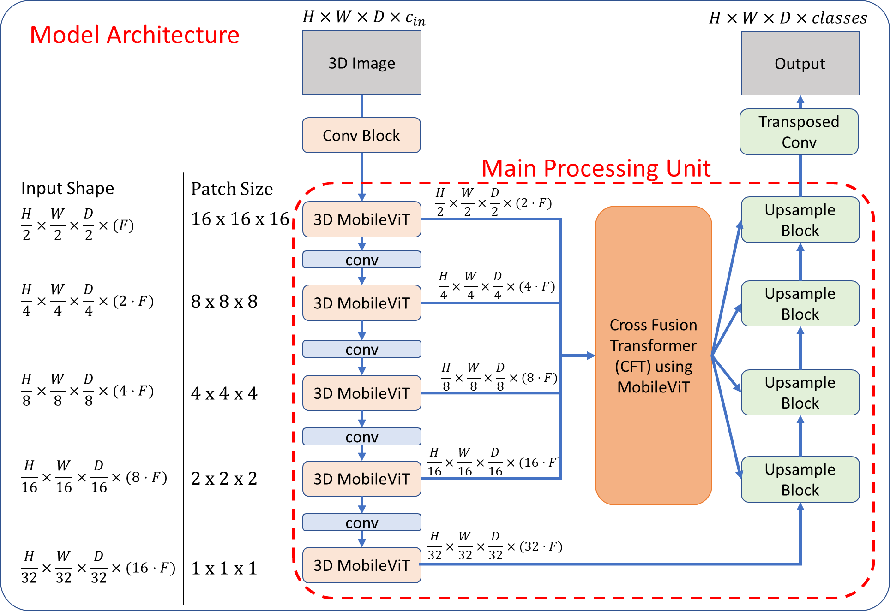

# UNET-MV

This repository contains the source code for the UNET-MV model. Multiple files have been adapted from the [MONAI UNETR implementation](https://github.com/Project-MONAI/research-contributions/tree/main/UNETR/BTCV/). 

The following tree structure indicates the files which have been newly written as well as the files which have been adapted and adopted from the MONAI repository:
```
└── UNETMV
    ├── main.py (adapted)
    ├── README.md
    ├── requirements.txt
    ├── test.py (adapted)
    ├── trainer.py (adapted)
    ├── networks
    │   ├── caupblock.py (new)
    │   ├── cft.py (new)
    │   ├── crossattention.py (new)
    │   ├── crosstransformer.py (new)
    │   ├── mobilevit.py (new)
    │   ├── unetmv.py (new)
    │   └── unetr.py (adopted)
    ├── optimizers
    │   ├── lr_scheduler.py (adopted)
    └── utils
        ├── data_utils.py (adapted)
        └── utils.py (adopted)
```
 
# Main contributions

Introduced a novel architecture to reduce computational cost by incorporating the 2D MobileVit, Axial Attention and Cross Scale transformer into a U-NET architecture. This removes the need for positional encodings and reduce the cost of self attention. Cross scale information sharing has enhanced the learning process. 

The model has been tested on the [AMOS](https://amos22.grand-challenge.org/) and [BTCV](https://www.synapse.org/#!Synapse:syn3193805/wiki/217752) datasets. 

# Data preprocessing
The set of preprocessing steps have been referenced from the MONAI UNETR implementation.

# Training
Hyperparameters are tuned for the BTCV dataset. It is impractical to conduct hyperparameter tuning on the AMOS dataset due to the dataset's size. Optimised hyperparameters have been used to conduct training on the datasets. Specifically, the model was trained for 5000 epochs on the BTCV and AMOS-MRI dataset while it is trained for 1000 epochs for the AMOS-CT dataset.

# Results
|          | Cost (GFlops) | Dice (%) | 95HD (mm) |
|----------|---------------|----------|-----------|
| AMOS-CT  | 26            | 85.3     | 4.58      |
| AMOS-MRI | 9             | 80.4     | 4.48      |
| BTCV     | 26            | 80.4     | 5.95      |


# Trained models
The links to the trained models can be found here: 1. [AMOS-CT](https://drive.google.com/file/d/1PU9MRzjHqChhkAbTXy9HtmwLrqh8ahpt/view?usp=drive_link), 2. [AMOS-MRI](https://drive.google.com/file/d/1JOU5GZXv1UsI-TQM0CMakH6TF88SStKH/view?usp=drive_link), 3. [BTCV](https://drive.google.com/file/d/1Zvbe2NbuhCUL0kpTdtns0GH81ak4HGlE/view?usp=drive_link) 

The model should be initialised in the following manner where the number of `out_channels = 14 or 16` depending on the dataset. For the AMOS-CT and BTCV datasets, the following are used: `img_size = (96,96,96)`,  `patch_size = (16,16,16)`. For the AMOS-MRI dataset, the following are used: `img_size = (96,48,48)`,  `patch_size = (16,8,8)`. 
```
model = UNETMV(
            in_channels = 1,
            out_channels = out_channels,
            img_size = (96,96,96),
            feature_size = 8,
            hidden_size = 72,
            mlp_dim = 288,
            num_heads = 9,
            norm_name = "instance",
            conv_block = True,
            res_block = True,
            patch_size = (16,16,16),
            dropout_rate = 0,
            decode_mode="simple",
            cft_mode="channel"
        )
```            